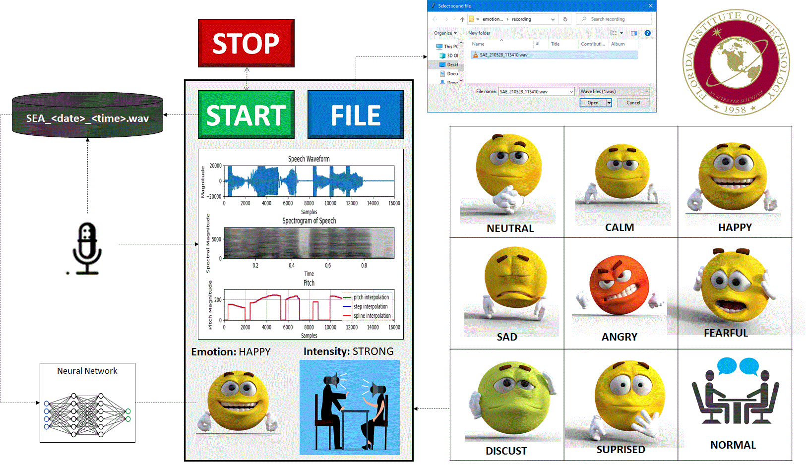
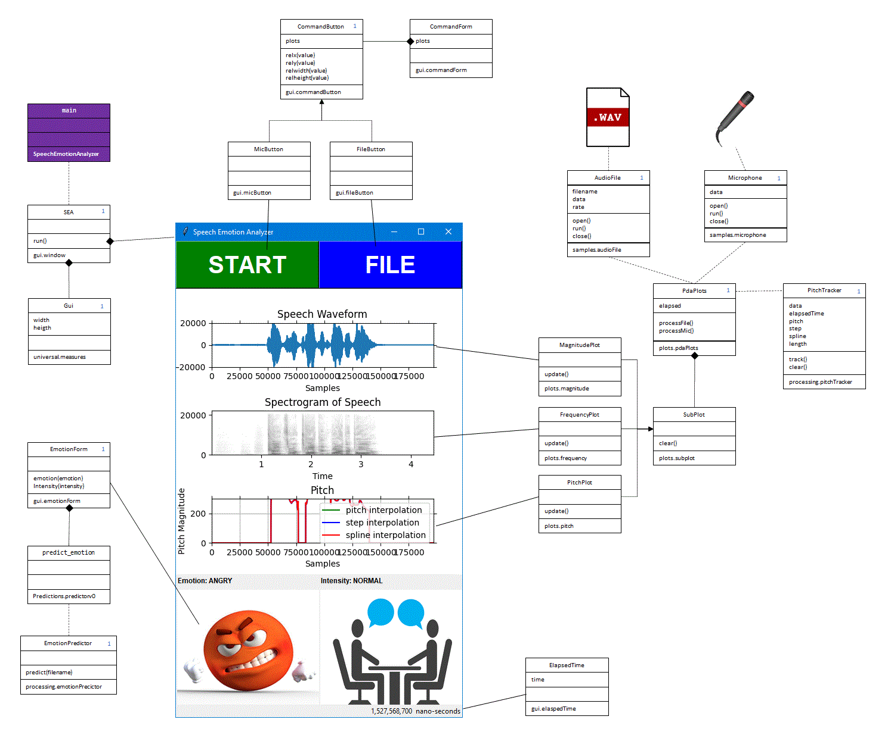


**Table of Contents**

1. [Goal](#Goal)
1. [Install](#Install)
1. [Operation](#Operation)
1. [Code](#Code)
1. [Future](#Future)

----
# Goal
> Perform real time speech analysis and emotion detection.  The application displays various audio plots and detected emotion.  Recordings are stored, while real time analysis is running.

[top](#top)

----
# Install

## Resources
The application is currently just Python code.  Here is a list of resources needed to run it.
1. Git
    1. Windows: Download [GitHub Desktop](https://desktop.github.com/)
    1. Linux: Perform [correct install](https://git-scm.com/download/linux) for your variant.
1. [Python](https://www.python.org/downloads/)
1. [wheel](https://pypi.org/project/wheel/)
1. [pyaudio](https://pypi.org/project/PyAudio/)
    1. Windows: 
        1. Visual Studio C++ 14.0 is required to compile the library on Windows.  Download the [Microsoft C++ Build Tools](https://visualstudio.microsoft.com/visual-cpp-build-tools).
        1. Download the [PyAudio bindings for you version of Python](https://www.lfd.uci.edu/~gohlke/pythonlibs/#pyaudio) (e.g. PyAudio‑0.2.11‑cp37‑cp37m‑win_amd64.whl for Python 3.7).
        1. Install (e.g. pip3 install .\PyAudio‑0.2.11‑cp37‑cp37m‑win_amd64.whl).
1. [numpy](https://numpy.org/install)
1. [pillow](https://pillow.readthedocs.io/en/stable/installation.html)
1. [sklearn version 0.22.0](https://pypi.org/project/scikit-learn/0.22.2/)
    1. Windows: Change the [LongPathsEnable to 1](https://stackoverflow.com/a/62196666/9560214) or to avoid path error.
1. [soundfile](https://pypi.org/project/SoundFile/)
1. [librosa](https://pypi.org/project/librosa/)
1. [text2emotion](https://pypi.org/project/text2emotion/)
1. [matplotlib](https://pypi.org/project/matplotlib/)
1. [amfm_decompy](https://pypi.org/project/AMFM-decompy/)

## Access
The project is currently in the [vkepuska/ece5560-spring2021](https://github.com/vkepuska/ece5560-spring2021) repository.  To gain access, contact [Dr.Kepuska](<mailto:vkepuska@fit.edu>) with your GitHub username.  He will have to [invite you as a collaborator](https://github.com/vkepuska/ece5560-spring2021/settings/access) so that you can clone it.

[top](#top)

----
# Operation

## Recoding
Pressing the [START button](gui/micButton.py#L30) will [create a wave file])(samples/microphone.py#L43) with the date/time.  These files are save in a *'recoding'* folder.  The audio from a microphone will be sent to the [wave file](samples/microphone.py#L140) and be [used by the plots](plots/pdaPlots.py#L93).  Every [5 seconds](universal/constants.py#L11) (or clicking the STOP button), the wave file will be saved, the [emotion predicted](samples/microphone.py#L77), and a [new wave file started](samples/microphone.py#L79).

## File
Pressing the [FILE button](gui/fileButton.py) will display a [file browser](gui/fileBrowser.py) for the user to select a wave file for the audio will be [plotted](gui/fileButton.py#L49) and [emotion predicted](gui/fileButton.py#L50).

[top](#top)

----
# Code
The code has been well documented.  The following shows a mapping to the various classes to GUI and processing.

[top](#top)

----
# Future
The following is a list of possible future improvements.

1. Improve Neural Network Model
    1. The [model](predictions/basic.model) currently only produces a [subset](predictions/utils.py#L25) prediction of the [available emotions](https://www.kaggle.com/ejlok1/audio-emotion-part-1-explore-data?rvi=1&scriptVersionId=20844990&cellId=13).  Update the model to support all emotions.
    1. The RAVDESS dataset includes classes for [emotional intensity](https://www.kaggle.com/ejlok1/audio-emotion-part-1-explore-data?rvi=1&scriptVersionId=20844990&cellId=13).  The application could [update intensity](gui/emotionForm.py#L65) per [prediction](processing/emotionPredictor.py#L15) from model.  If the model were updated to include intensity, the application should need little to no changes.
    1. The model could be updated to include more [datasets](https://www.kaggle.com/ejlok1/audio-emotion-part-1-explore-data) and could be [augmented](https://www.kaggle.com/ejlok1/audio-emotion-part-5-data-augmentation) to help produce more input permutations.
    1. The model could be updates to utilize more [features](https://www.kaggle.com/ejlok1/audio-emotion-part-2-feature-extract).

1. Integrate Mobile Phone Solution
    1. A desired goal is for the application to work on an Adroid phone. This was attemped using [Pydroid 3](https://play.google.com/store/apps/details?id=ru.iiec.pydroid3&hl=en_US&gl=US), but [PyAudio does not yet work on Android](https://stackoverflow.com/questions/12162008/pyaudio-on-android).  Here are a few approaches:
        1. Wrapper (i.e. Android application) for PyAudio.
        1. Update PyAudio to be Android compatiable.
        1. Refactor code to be an [Andoid application](https://www.techradar.com/news/phone-and-communications/mobile-phones/how-to-build-an-android-app-1046599).
    1. Get the application to run on an iPhone.

1. Lie Detection
With a dataset that classifes a person telling the truth vs a lie, a model could be trained to detect a lie.  If so, the application could predict this.

1. Quefrency
It was proposed to use [quefrency](../SQT%20Slides%2016-4-2021.pdf) as a feature set for the model and to plot its pitch.

1. More Audio Formats
The application currently only works with [wave files](http://soundfile.sapp.org/doc/WaveFormat/).  It could be updates for [others](https://docs.fileformat.com/audio/) (e.g. [mp3](http://mpgedit.org/mpgedit/mpeg_format/MP3Format.html))

[top](#top)